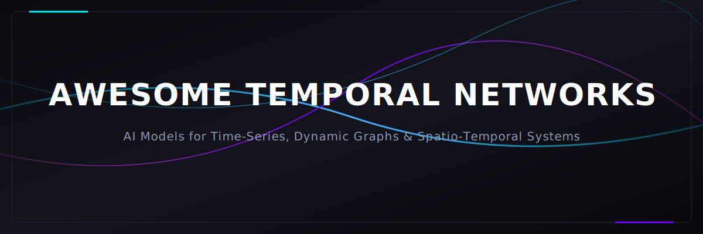
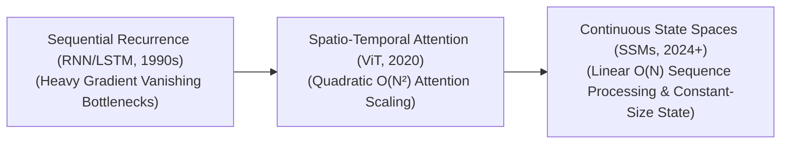

<!--
SEO Meta Description: A curated list of awesome temporal networks, time-series forecasting models, spatio-temporal graph neural networks (ST-GNNs), continuous-time neural ODEs, and state space models (SSMs/Mamba) in deep learning.
Keywords: Temporal Networks, AI, Time-Series Forecasting, Spatio-Temporal GNNs, State Space Models, Mamba, Neural ODEs, Deep Learning, Recurrent Neural Networks, Transformers
-->

# Awesome-Temporal-Networks

  

  

## 🕒 Temporal Networks in AI: History, Progression, Variants, & Applications

Temporal Networks—broadly spanning Time-Series networks, Dynamic Graphs, and Spatio-Temporal systems—represent a specialized family of neural network architectures designed to process data that evolves dynamically over time. In standard deep learning, static models (like standard Feed-Forward networks or basic CNNs) assume that data samples are independent and identically distributed (i.i.g.). Temporal Networks break this assumption by treating time as an explicit structural dimension. By mapping chronological dependencies, hidden trajectories, and shifting state variables, Temporal Networks allow AI systems to model continuous physical waveforms, track multi-agent interactions across fluid graphs, and execute high-frequency sequential forecasting.

---

## 📅 1. The Macro Chronological Evolution

The technical implementation of temporal modeling has transitioned from rigid, sequential recurrence loops to gated memory cells, parallelized attention patches, and hardware-fused continuous state-space operators.

| Era / Paradigm | Year | Paper Link | Details |
| :--- | :--- | :--- | :--- |
| [**The Sequential Recurrence Era** (RNN / LSTM)](details/sequential_recurrence.md) | 1997 | [LSTM (Hochreiter & Schmidhuber, 1997)](https://doi.org/10.1162/neco.1997.9.8.1735) | **Concept:** The structural baseline. Networks like **Recurrent Neural Networks (RNNs)** processed sequence steps one-by-one, passing a hidden state vector forward through time. This was stabilized by the **Long Short-Term Memory (LSTM, 1997)** network, which introduced input, forget, and output gates to create a linear memory highway. **Limitation:** Catastrophically memory-bandwidth bound and prone to vanishing gradients over long sequences. Because step $t+1$ depends strictly on step $t$ finishing, the architecture cannot parallelize across GPU hardware arrays during training. |
| [**The Parallel Time-Collapsing Attention Era** (Transformers / Spatio-Temporal ViTs)](details/parallel_attention.md) | 2017 | [Transformer (Vaswani et al., 2017)](https://arxiv.org/abs/1706.03762) [ViT (Dosovitskiy et al., 2020)](https://arxiv.org/abs/2010.11929) | **Concept:** Eliminated sequential unrolling entirely. The **Transformer (2017)** reframed temporal tracking as a parallelized dot-product operation using Self-Attention, mapping long-range dependencies across time with a constant path length of $O(1)$. This mutated into **Spatio-Temporal Vision Transformers (ViTs)**, which slice video clips into 3D spacetime token cubes to process space and time concurrently. **Limitation:** Suffered from a **Quadratic Computational Wall ($O(N^2)$)** relative to sequence duration, causing Key-Value (KV) cache memory to explode over long context windows. |
| [**The Continuous Selective State Space Era** (SSMs / Mamba)](details/continuous_selective_state_space.md) | 2023 | [Mamba (Gu & Dao, 2023)](https://arxiv.org/abs/2312.00752) | **Concept:** The current modern state-of-the-art infrastructure baseline. Popularized by architectures like **Mamba** and structured **State Space Models (SSMs)**. It merges the parallel training speed of Transformers with the compact inference footprint of RNNs. By discretizing continuous-time differential equations using hardware-aware **Selective Scan Algorithms**, the model compresses the entire temporal history into a fixed-size hidden state matrix. **Significance:** Achieves true **Linear Scaling ($O(N)$)** with sequence length and flat constant-size memory overhead during inference, allowing models to parse infinite streaming temporal signals smoothly. |

---

## ⚙️ 2. Core Functional & Algorithmic Variants

Temporal Networks are strictly categorized based on whether they process data over isolated indices, geometric structures, or continuous waveforms.

| Variant | Year | Paper Link | Details |
| :--- | :--- | :--- | :--- |
| [**A. Discrete Sequence Networks**](details/discrete_sequence_networks.md) | 1997 | [LSTM (Hochreiter & Schmidhuber, 1997)](https://doi.org/10.1162/neco.1997.9.8.1735) [GRU (Cho et al., 2014)](https://arxiv.org/abs/1406.1078) | **Mechanism:** Unrolls a sequential computational graph over a fixed set of time-steps, utilizing Backpropagation Through Time (BPTT) to update shared recurrence parameters. **Pros:** Compact inference memory footprint, but suffers from low GPU compute saturation due to its non-parallelizable nature. |
| [**B. Spatio-Temporal Graph Neural Networks (ST-GNNs)**](details/spatio_temporal_gnns.md) | 2017 | [STGCN (Yu et al., 2017)](https://arxiv.org/abs/1709.04875) | **Mechanism:** Combines spatial Graph Neural Networks with temporal modeling layers. It tracks how node features and edge connectivity matrices evolve dynamically across time. **Application:** Standard layout for traffic flow optimization, social network connection forecasting, and multi-agent financial fraud tracking. |
| [**C. Temporal Convolutional Networks (TCNs)**](details/temporal_convolutional_networks.md) | 2016 | [TCN (Lea et al., 2016)](https://arxiv.org/abs/1611.05267) [TCN Sequence Modeling (Bai et al., 2018)](https://arxiv.org/abs/1803.01271) | **Mechanism:** Replaces recurrence with 1D causal, dilated convolutional layers. The kernel matrix injects regular mathematical gaps to expand its effective receptive field backward into history without adding parameters. **Pros:** Fully parallelizable during training loops, avoiding the vanishing gradient traps of early RNNs. |
| [**D. Continuous-Time Neural ODEs / Selective SSMs**](details/neural_odes_selective_ssms.md) | 2018 | [Neural ODEs (Chen et al., 2018)](https://arxiv.org/abs/1806.07366) [Mamba (Gu & Dao, 2023)](https://arxiv.org/abs/2312.00752) | **Mechanism:** Abandons discrete step intervals. It treats temporal transitions as a continuous-time vector field solver, using data-dependent discretization parameters ($\Delta$) to sample raw wave inputs dynamically. |

---

## 🧩 3. High-Capacity Architectural Component Types

To scale up temporal processing precision without blowing up VRAM budgets, ML engineering stacks deploy specialized time-tracking layers.

| Component Type | Year | Paper Link | Profile |
| :--- | :--- | :--- | :--- |
| [**Temporal Attention Sinks**](details/temporal_attention_sinks.md) | 2023 | [StreamingLLM (Xiao et al., 2023)](https://arxiv.org/abs/2309.17453) | Prevents memory crashes during infinite sequence generation. It discovers that the absolute first 2 to 4 tokens in a temporal sequence absorb massive amounts of attention focus. The cache permanently freezes these initial anchor states while rolling a sliding window mask over subsequent steps. |
| [**Rotary Position Embeddings (RoPE)**](details/rotary_position_embeddings.md) | 2021 | [RoFormer (Su et al., 2021)](https://arxiv.org/abs/2104.09864) | Structures chronological coordinates. Instead of adding flat static values, it multiplies feature vectors by a complex rotation matrix, encoding relative distance and time offsets geometrically as an angle. |
| [**Parallel Associative Scan Kernels**](details/parallel_associative_scan.md) | 1990 | [Prefix Sums (Blelloch, 1990)](https://www.cs.cmu.edu/~blelloch/papers/Ble90.pdf) [Mamba (Gu & Dao, 2023)](https://arxiv.org/abs/2312.00752) | Fuses execution loops. It transforms sequential time-step accumulations into a highly parallelized associative matrix multiplication step compiled directly inside fast GPU SRAM registers. |

---

## ⚡ 4. Production Engineering Challenges & Hardware Solutions

Deploying high-frequency Temporal Networks across enterprise industrial architectures introduces intense memory-bus and data-sync bottlenecks.

| Challenge | Year | Paper Link | Description & Mitigation |
| :--- | :--- | :--- | :--- |
| [**The Key-Value Cache VRAM Inflation Wall**](details/kv_cache_vram_inflation.md) | 2023 | [PagedAttention (Kwon et al., 2023)](https://arxiv.org/abs/2309.06180) [DeepSeek-V2 MLA (Liu et al., 2024)](https://arxiv.org/abs/2405.04434) | **Problem:** Processing long temporal streams or video sequences inside Transformer blocks requires storing the attention vectors for all historical steps. As horizons scale, this KV cache consumes gigabytes per user layer, triggering system crashes. **Mitigation:** Implementing **Multi-Head Latent Attention (MLA)** to compress cache matrices down into a low-rank latent vector, coupled with **PagedAttention virtual memory allocation** to eliminate VRAM fragmentation. |
| [**The Continuous Real-Time Streaming I/O Bottleneck**](details/real_time_streaming_io.md) | 2019 | [Triton (Tillet et al., 2019)](https://dl.acm.org/doi/10.1145/3318170.3318190) | **Problem:** Ingesting continuous high-frequency streams (such as seismic indicators or financial market order books) requires low-latency data parsing. Standard deep networks introduce processing delays that break real-time control constraints. **Mitigation:** Compiling temporal processing pipelines into **Fused Triton Kernels**, executing feature extraction and state updates entirely within GPU registers to bypass global system memory bottlenecks. |

---

## 🚀 5. Frontier Real-World AI Applications

| Application Field | Year | Paper Link | Application Details |
| :--- | :--- | :--- | :--- |
| [**High-Frequency Algorithmic Portfolio Risk Forecasting**](details/algorithmic_portfolio_risk_forecasting.md) | 2017 | [LSTM Portfolio (Krauss & Alberg, 2017)](https://doi.org/10.1016/j.eswa.2017.07.032) [Deep Portfolio (Zhang et al., 2020)](https://arxiv.org/abs/2005.13665) | Processes millions of concurrent multi-asset financial streams. Continuous-time state-space models and TCNs analyze shifting market covariances and transaction logs, updating portfolio risk allocations and adjusting stop-loss parameters automatically before market execution cycles. |
| [**Spatio-Temporal Video Generative Flow-Matching (Sora Class)**](details/video_generative_flow_matching.md) | 2022 | [Flow Matching (Lipman et al., 2022)](https://arxiv.org/abs/2210.02747) [Sora Tech Report (OpenAI, 2024)](https://openai.com/research/video-generation-models-as-world-simulators) | Drives advanced physical simulation platforms. Video clips are tokenized into 3D spacetime cubes; the factorized multi-head attention blocks process these cubes concurrently, tracking horizontal, vertical, and chronological changes to generate fluid, physically consistent animations. |
| [**Neuromorphic Event-Based Signal Comprehension**](details/neuromorphic_event_based_signal.md) | 1997 | [SNNs (Maass, 1997)](https://doi.org/10.1016/S0893-6080(97)00011-7) [Event-Based Vision (Gallego et al., 2020)](https://arxiv.org/abs/1904.08405) | Paired directly with Dynamic Vision Sensors (DVS) or wearable health monitors. Spiking Neural Networks (SNNs) and selective SSMs process continuous, asynchronous streaming spike data natively, tracking moving targets (such as drone obstacle avoidance arrays) with microsecond temporal precision. |

---

## 📚 References
1. Hochreiter, S., & Schmidhuber, J. (1997). Long short-term memory. *Neural Computation*, 9(8), 1735-1780.
2. Bai, S., Kolter, J. Z., & Koltun, V. (2018). An empirical evaluation of generic convolutional and recurrent networks for sequence modeling. *arXiv preprint arXiv:1803.01271*.
3. Chen, R. T., et al. (2018). Neural ordinary differential equations. *Advances in Neural Information Processing Systems (NeurIPS)*, 31.
4. Dosovitskiy, A., et al. (2020). An image is worth 16x16 words: Transformers for image recognition at scale. *arXiv preprint arXiv:2010.11929*.
5. Gu, A., & Dao, T. (2023). Mamba: Linear-time sequence modeling with selective state spaces. *arXiv preprint arXiv:2312.00752*.
6. Xiao, G., et al. (2023). Efficient streaming language models with attention sinks. *arXiv preprint arXiv:2309.17453*.

---

To advance this documentation repository, infrastructure workspace, or algorithmic pipeline, consider exploring these adjacent development pathways:
* Build a **Python code snippet using PyTorch** illustrating how to construct a basic 1D Temporal Convolutional Network (TCN) layer block including dilated padding parameters.
* Generate a **comprehensive Markdown table** explicitly comparing LSTMs, TCNs, Transformers, and Selective State Space Models (Mamba) across training parallelization limits, inference memory complexity, path length boundaries, and sampling capabilities.
* Establish a **performance profiling harness using Triton** to measure the exact wall-clock throughput and VRAM saving bounds achieved when compiling parallel associative scan kernels directly into fast registers.

