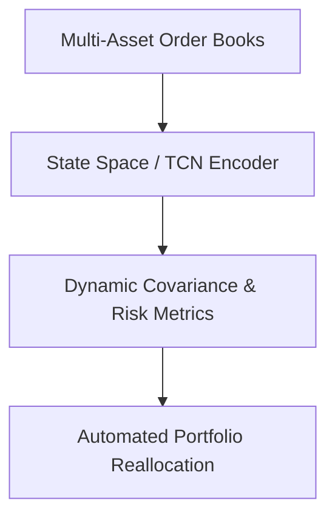

# High-Frequency Algorithmic Portfolio Risk Forecasting

Real-time multi-asset financial temporal predictions.

## Overview
Deploys TCNs and SSMs on continuous market streaming logs to forecast covariances and optimize portfolio risk.

## Architectural Diagram

## Key Mechanisms
- **High-Frequency Ingestion:** Processing millions of events per second.
- **Dynamic Hedging:** Automated adjustments based on temporal volatility forecasting.

[Back to README](../README.md)
