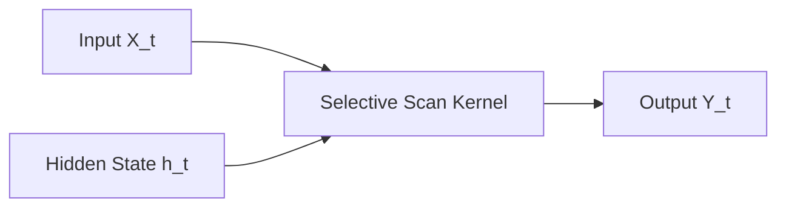

# The Continuous Selective State Space Era (SSMs / Mamba)

State Space Models (SSMs) provide linear time-series scaling with constant-size memory.

## Overview
Mamba leverages selective scan algorithms to update continuous-time differential equations dynamically based on the input context.

## Architectural Diagram

## Key Mechanisms
- **Selective Scan:** Hardware-aware parallel scanning.
- **Linear Complexity:** $O(N)$ training and $O(1)$ inference memory overhead.

[Back to README](../README.md)
