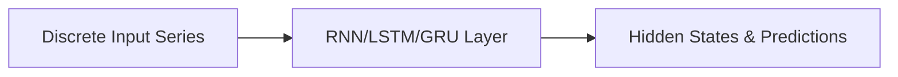

# A. Discrete Sequence Networks (RNNs / LSTMs / GRUs)

Standard sequential architectures operating on discrete time steps.

## Overview
These models are suited for discrete sequences but suffer from lack of parallelization.

## Architectural Diagram

## Key Mechanisms
- **Backpropagation Through Time (BPTT):** Updates shared recurrent weights.
- **Gated Recurrent Unit (GRU):** Simplified gating mechanism compared to LSTM.

[Back to README](../README.md)
