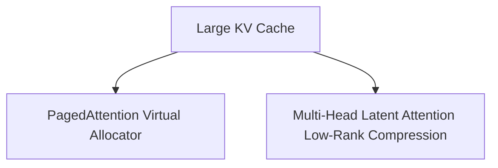

# The Key-Value Cache VRAM Inflation Wall

Mitigating the VRAM memory footprint of long context windows.

## Overview
As temporal context length grows, storing Key-Value states in standard attention blocks consumes gigabytes of VRAM.

## Architectural Diagram

## Key Mechanisms
- **PagedAttention:** Virtual memory paging for KV cache to prevent fragmentation.
- **MLA:** Dynamic low-rank projection for Query/Key/Value states.

[Back to README](../README.md)
