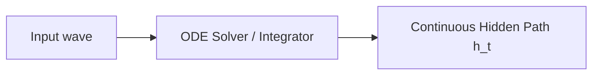

# D. Continuous-Time Neural ODEs / Selective SSMs

Differential equation-based continuous time models.

## Overview
Abandons discrete step intervals, representing hidden states as continuous vector field paths.

## Architectural Diagram

## Key Mechanisms
- **ODE Solver:** Adaptive step-size integration.
- **Input-dependent discretization ($\Delta$):** Adapts sample rates on the fly.

[Back to README](../README.md)
