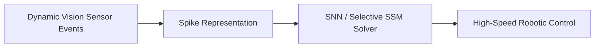

# Neuromorphic Event-Based Signal Comprehension

Native processing of asynchronous spiking camera signals.

## Overview
Processes continuous sparse data events from silicon retinas using Spiking Neural Networks (SNNs) and selective SSMs.

## Architectural Diagram

## Key Mechanisms
- **Asynchronous Spikes:** Computes only when physical change occurs.
- **SNNs:** Biologically plausible spiking neuron dynamics.

[Back to README](../README.md)
