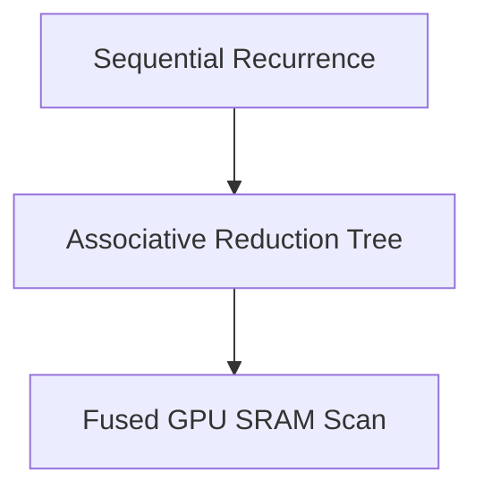

# Parallel Associative Scan Kernels

Exploiting associative properties to parallelize recurrences.

## Overview
Enables sequence scan computations to execute in parallel across GPU SRAM, bypassing global memory bottlenecks.

## Architectural Diagram

## Key Mechanisms
- **Associative Property:** $ (a \otimes b) \otimes c = a \otimes (b \otimes c) $.
- **Kernel Fusion:** Fused Triton/CUDA code blocks keeping updates in GPU register files.

[Back to README](../README.md)
