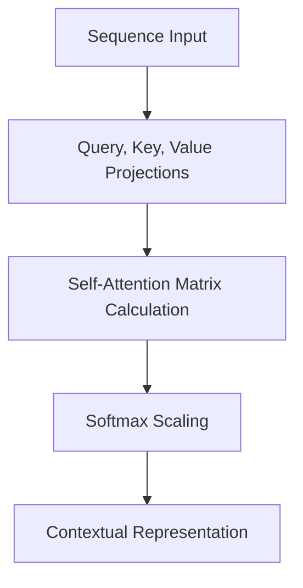

# The Parallel Time-Collapsing Attention Era (Transformers / Spatio-Temporal ViTs)

Replacing recurrence with parallel attention-based mechanisms.

## Overview
Self-attention maps long-range dependencies across time concurrently, enabling full parallelization during training.

## Architectural Diagram

## Key Mechanisms
- **Self-Attention:** $O(1)$ path length between any two steps.
- **Spatio-Temporal Tokens:** 3D spacetime cubes for video processing.

[Back to README](../README.md)
