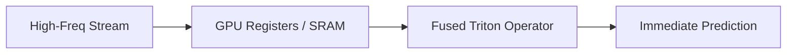

# The Continuous Real-Time Streaming I/O Bottleneck

Bypassing input/output latencies for real-time streaming inference.

## Overview
Ingesting high-frequency streams requires low-latency processing without global CPU-GPU memory bus roundtrips.

## Architectural Diagram

## Key Mechanisms
- **Fused Triton Kernels:** Direct register-level temporal feature updates.
- **Zero Copy I/O:** Minimizes host-to-device streaming latency.

[Back to README](../README.md)
