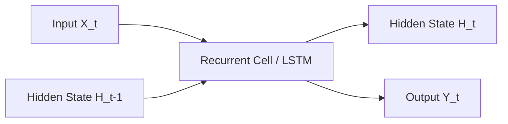

# The Sequential Recurrence Era (RNN / LSTM)

The sequential recurrence era marks the foundation of temporal modeling in deep learning.

## Overview
Sequential recurrence models process input sequences step-by-step, maintaining a hidden state that acts as the network's memory.

## Architectural Diagram

## Key Mechanisms
- **Step-by-step updates:** The hidden state is updated iteratively.
- **Gating mechanisms (LSTM):** Introduced input, forget, and output gates to solve the vanishing gradient problem.

[Back to README](../README.md)
