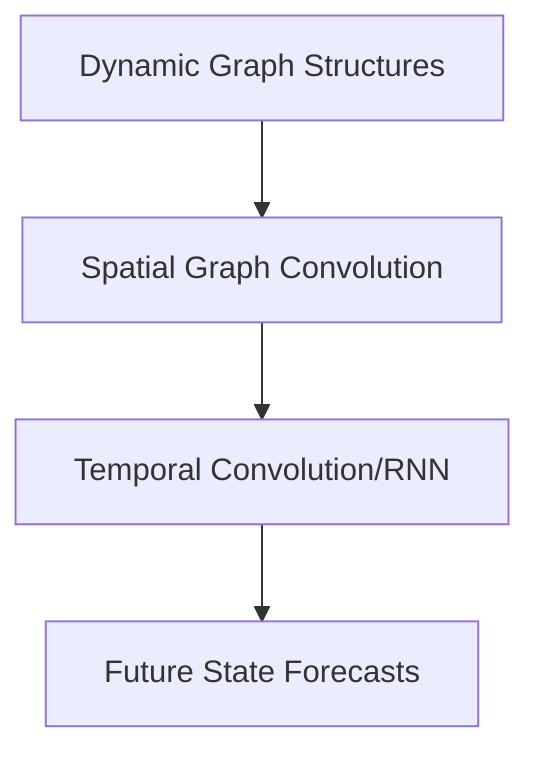

# B. Spatio-Temporal Graph Neural Networks (ST-GNNs)

Graph neural networks combined with temporal modeling.

## Overview
Used for modeling spatial connections that change or exhibit dynamics over time, like traffic systems.

## Architectural Diagram

## Key Mechanisms
- **Spatial Graph Convolution:** Aggregates neighboring node states.
- **Temporal Modeling Layer:** Learns changes in structural matrices over time.

[Back to README](../README.md)
