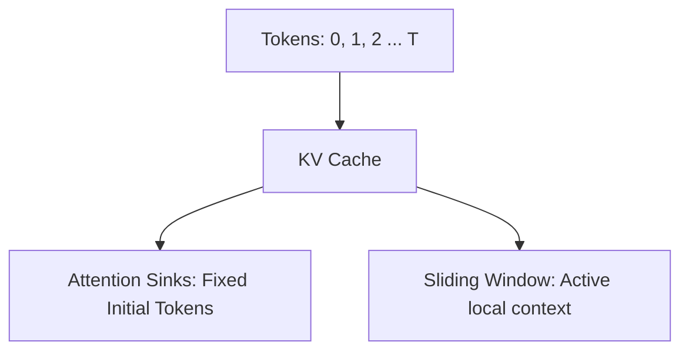

# Temporal Attention Sinks

Maintaining attention context indefinitely without exploding cache size.

## Overview
Discovers that the initial 2-4 tokens act as attention anchors, absorbing high attention values.

## Architectural Diagram

## Key Mechanisms
- **Streaming Cache:** Keeps initial tokens and a sliding window.
- **No Performance Drop:** Avoids performance collapse on extremely long sequences.

[Back to README](../README.md)
