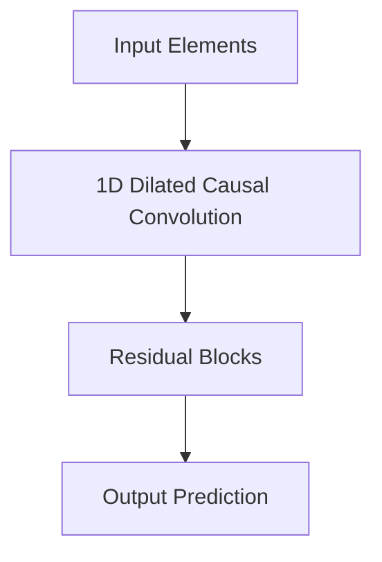

# C. Temporal Convolutional Networks (TCNs)

Using 1D causal dilated convolutions for sequence modeling.

## Overview
Replaces recurrence with causal convolutions, allowing parallel training like Transformers.

## Architectural Diagram

## Key Mechanisms
- **Causal Convolutions:** Ensures no information leakage from future to past.
- **Dilated Convolutions:** Exponentially expanding receptive field.

[Back to README](../README.md)
