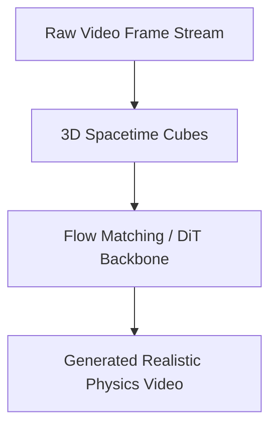

# Spatio-Temporal Video Generative Flow-Matching (Sora Class)

Generative modeling of spatio-temporal video sequences.

## Overview
Video sequences are tokenized into 3D spacetime cubes and processed using Diffusion Transformers or Flow-Matching.

## Architectural Diagram

## Key Mechanisms
- **3D Spacetime Tokenization:** Joint spatial and temporal token tracking.
- **Flow Matching:** Straight-path trajectories for faster generation.

[Back to README](../README.md)
